<div align="center">

# DEADWEIGHT

**AI model and skill supply-chain analyzer.**<br>
Know what your AI dependencies do when they load.

[](https://github.com/het-P301204/deadweight/actions/workflows/ci.yml)
[](LICENSE)
[](https://nodejs.org)
[](src/engine)
[](package.json)
[](SECURITY.md)

</div>

DEADWEIGHT points at a codebase and answers one question about every AI
artifact it finds:

```
ARTIFACT -> FORMAT -> LOAD SITE -> LOAD BEHAVIOUR -> CONTEXT -> EVIDENCE -> ALTERNATIVE
```

It never loads the artifact to do it.

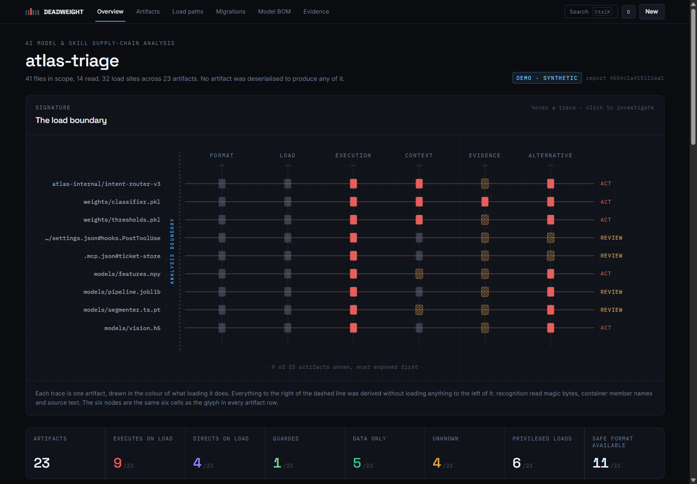

```bash
# No install, no build, no dependencies. Node 24+.
git clone https://github.com/het-P301204/deadweight.git
cd deadweight && node bin/deadweight.ts scan fixtures/demo-project
```

**Contents** · [The problem](#the-problem) · [What it reports](#what-it-reports)
· [Why it matters](#why-it-matters) · [Architecture](#architecture)
· [Example](#example) · [Screenshots](#screenshots)
· [Capabilities](#capabilities) · [Limitations](#limitations)
· [Quick start](#quick-start) · [Security model](#security-model)
· [Development](#development) · [Documentation](#documentation)

---

## The problem

This line either executes attacker-controlled code or it does not:

```python
state = torch.load("weights/ranker.bin")
```

Which one depends on a number in a requirements file three directories away.
`torch.load` unpickled without restriction on every call until PyTorch 2.6
flipped `weights_only` to default `True`. So:

| `requirements.txt` | what that line is |
| --- | --- |
| `torch==2.5.1` | an arbitrary code execution primitive |
| `torch==2.7.0` | a read through an allowlisting unpickler |
| `torch>=2.0` | **nobody knows** |

The same shape recurs. `numpy.load` and `allow_pickle`. `keras.load_model`
and `safe_mode`, which flipped when Keras 3 landed.
`from_pretrained(trust_remote_code=True)`, where the execution surface is not
a file format at all but a repository that can change between the review and
the run.

Model scanners answer a different question: *does this file contain something
on a list of known-dangerous imports?* That is a useful question with a
denylist-shaped answer. DEADWEIGHT asks the structural one instead — **does
loading this execute code, where does that happen, who is standing there when
it does, and is there a format that removes the surface rather than watching
it** — and it reports scanner results as evidence about specific bytes rather
than as a verdict.

## What it reports

Five load behaviours. Nothing is averaged into a severity score, and nothing
silently becomes safe.

| | Behaviour | Means | Example |
| --- | --- | --- | --- |
| 🔴 | `code` | Loading it runs code. The format has no safe mode, or the call site has opted out of one. | `pickle.load`, `torch.load(weights_only=False)` |
| 🟣 | `directive` | Loading it injects instructions into a model's context. Nothing executes; what the system does still changes. | `SKILL.md`, an agent definition, a prompt template |
| 🟢 | `guarded` | The format has an execution surface and a flag at the call site is holding it shut. | `numpy.load(allow_pickle=False)` |
| 🟢 | `data` | No execution surface in the format at all. | `safetensors`, GGUF |
| 🟠 | `unknown` | The question is real and the repository does not answer it. Carries one of seven reason codes. | `torch>=2.0`, a path built at run time |

`unknown` is the point of the tool as much as `code` is. A range that spans
the release which changed a default answers nothing, and reporting that as
either safe or dangerous would be a guess dressed as a finding.

## Why it matters

An execution surface with no context is a list. A context with no execution
surface is an org chart. The product is the coordinate:

```<!-- dw:matrix -->
                    PROD    CI   BLD    NB   DEV   SBX UNRES
Executes on load       4     ·     1     2     2     1     2
Directs on load        ·     ·     ·     ·     3     ·     1
Guarded                1     ·     ·     ·     ·     ·     ·
Data only              2     ·     ·     ·     ·     1     2
Unknown                2     1     1     1     ·     1     1
<!-- /dw -->```

Four execution surfaces in production is a different sentence from nine
execution surfaces somewhere. There is no severity score anywhere in DEADWEIGHT,
because producing one would mean averaging those two axes, and averaging them
is how the row that matters gets buried under the rows that do not.

## Architecture

One engine, three front ends. They differ only in where the file tree comes
from, which is the only reason the demo is worth trusting as a demonstration
of the product.

```
                  ┌──────────────┐   ┌──────────────┐   ┌──────────────┐
                  │ node:fs walk │   │ File API     │   │ in-memory    │
                  │ (CLI)        │   │ (browser)    │   │ (demo/tests) │
                  └──────┬───────┘   └──────┬───────┘   └──────┬───────┘
                         └──────────────────┼──────────────────┘
                                      SourceTree
                                            │
   ┌────────────────────────────────────────▼────────────────────────────┐
   │ src/engine                                                         │
   │                                                                     │
   │  source scanners ──► load sites      classifiers ──► format         │
   │  (masked, alias-aware)               (magic bytes, zip names,       │
   │        │                              length-prefixed headers,      │
   │        │                              pickle opcodes — no loading)  │
   │        ▼                                     │                      │
   │  dependency resolver ───────────────► behaviour resolver            │
   │  (requirements, lockfiles)            (per site, most exposed wins) │
   │                                              │                      │
   │  context classifier ─────────────────────────┤                      │
   │  (declared / inferred / unresolved)          │                      │
   │                                              │                      │
   │  evidence binder ────────────────────────────┤                      │
   │  (digest-bound, coverage-stated)             │                      │
   │                                              ▼                      │
   │                             findings ──► Model BOM ──► diff         │
   └─────────────────────────────────────────────────────────────────────┘
```

`src/engine` touches no filesystem API and no browser global. The CLI runs its
TypeScript sources directly through Node's native type stripping: no build
step, no dependencies, nothing installed.

The analysis is deterministic by construction — no clock, no randomness, no
timestamps — so two runs over the same tree produce byte-identical canonical
JSON and the same digest. That is what makes a BOM diff a diff of the project
rather than a diff of when it was taken.

## Example

```<!-- dw:stages -->
$ node bin/deadweight.ts scan fixtures/demo-project

  walk          41 files in scope
  dependencies  19 declared, 16 pinned exactly
  load-sites    26 loader calls, 6 declarations
  artifacts     23 artifacts recognised without loading any of them
  behaviour     9 execute on load, 4 unresolved
  context       19 load contexts, 4 privileged
  evidence      8 of 8 records bound to an artifact
  bom           23 entries, 42 findings
<!-- /dw -->```

```
$ node bin/deadweight.ts explain fixtures/demo-project weights/ranker.bin

  weights/ranker.bin  ██░▓▓▓
  PyTorch archive · in-tree · sha256:b9767d75b9062fec

  WHAT HAPPENS WHEN IT LOADS
  Unknown
  What this line does depends on the installed PyTorch version, and the
  repository does not pin it tightly enough to say. Pinned below 2.6 it is
  arbitrary code execution; from 2.6 it is a restricted unpickler.

  HOW THAT WAS DECIDED
  • The call site is `torch.load`.
      .github/scripts/verify_checkpoint.py:14
  • No `weights_only` argument is passed, so the default decides.
      .github/scripts/verify_checkpoint.py:14
  • The default changed in PyTorch 2.6: before it, torch.load unpickled
    without restriction; from it, weights_only defaults to True.
      PyTorch 2.6 release notes
  • torch is constrained to `>=2.0`, which permits versions on both sides of 2.6
      requirements.txt

  SAFE ALTERNATIVE
  safetensors of the same weights is already in the repository
```

The six-cell glyph is the product's signature. `FMT LOAD EXEC CTX EVID ALT` —
solid where a stage resolved, hatched where it did not, coloured where the
answer needs a decision. It is the same six facts at three sizes: the diagram
on the overview, the glyph in every row, the traced path in the drawer.

## Screenshots

| | |
| --- | --- |
| 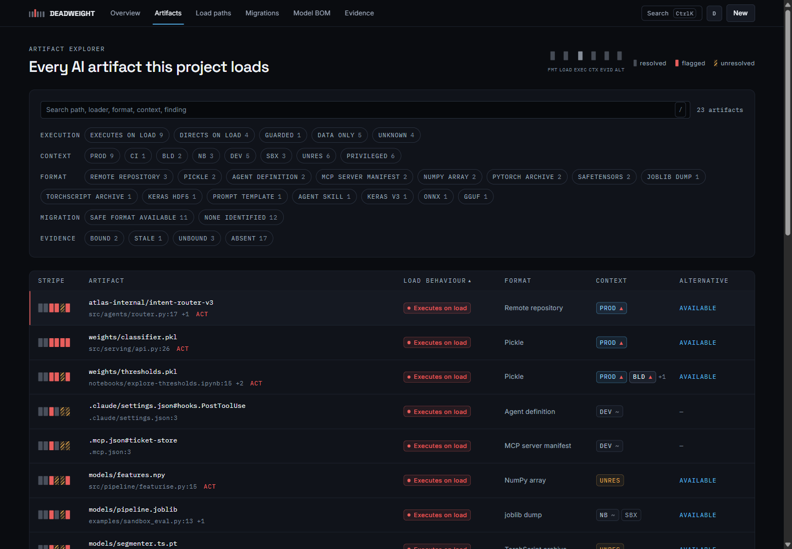 | 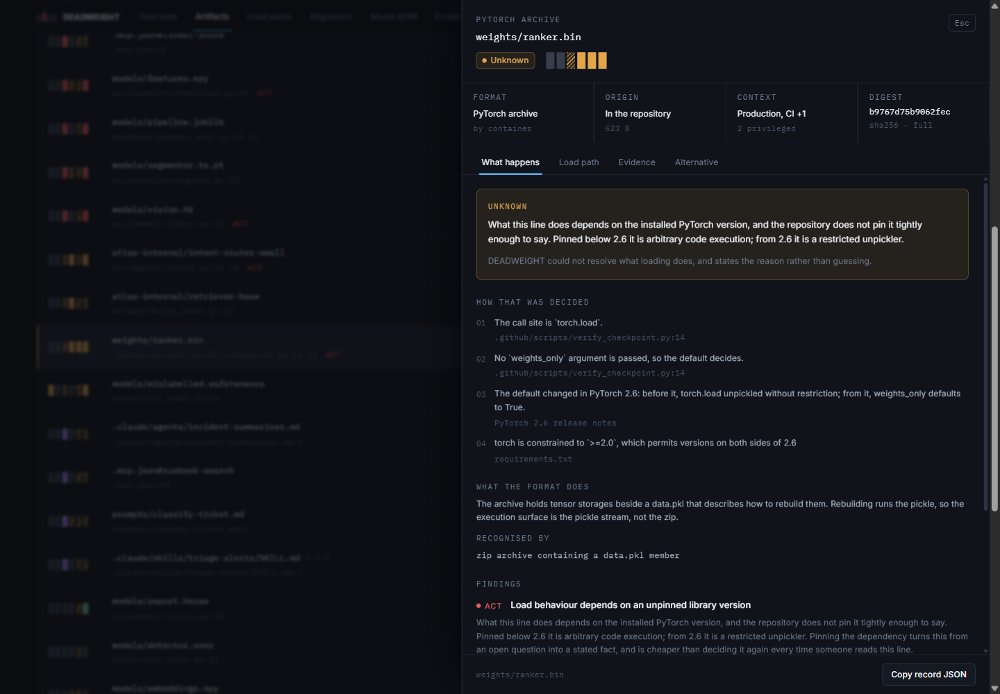 |
| **Artifact explorer** — the stripe replaces four badge columns, which is how a hundred rows stay dense without becoming cluttered. Filter by execution, context, format, migration and evidence; `/` to search, arrow keys to walk. | **Investigation** — what happens when it loads, and the reasoning that decided it, with a basis for every step. Four tabs, because five sections at once is a wall and the reader arrived with one question. |
| 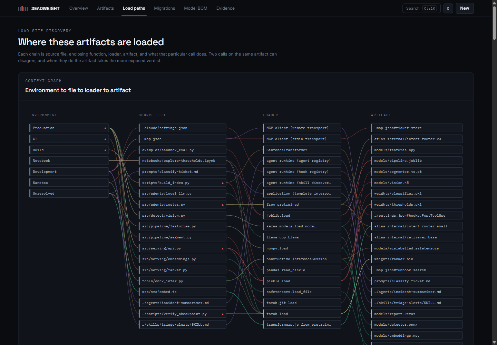 | 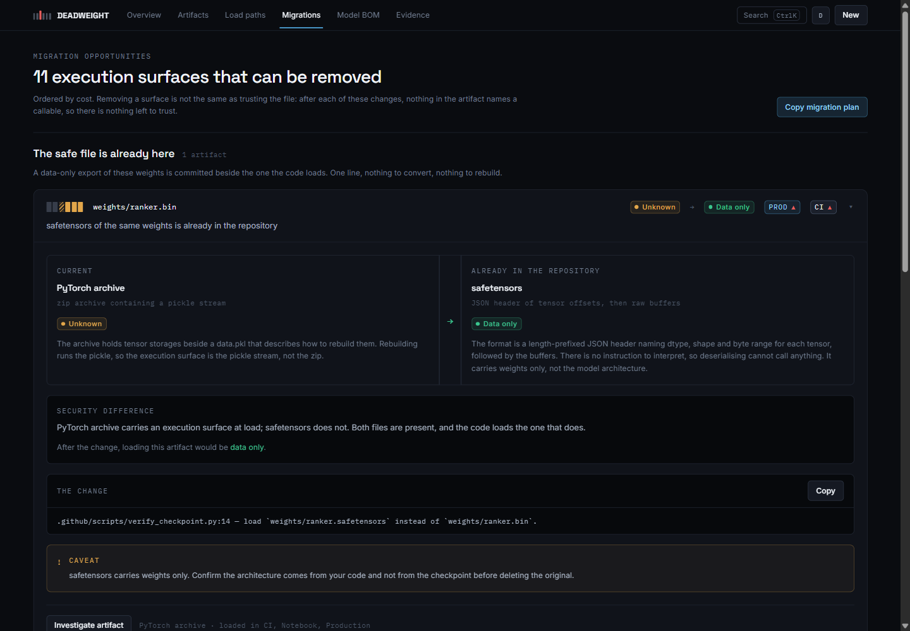 |
| **Load paths** — environment to source file to loader to artifact. Hover any node to light its connected path; the layout is arithmetic, so the same graph is in the same place every time. | **Migrations** — format comparison with the security difference stated, the change as copyable text, and the caveat that travels with it. Ordered by how cheap the fix is. |
| 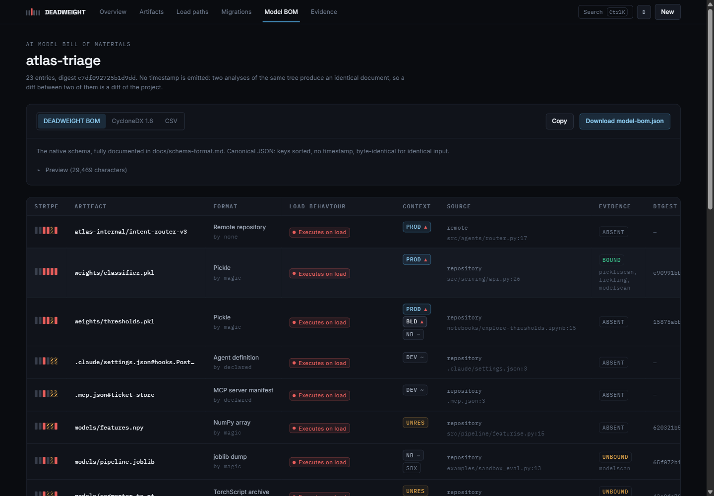 | 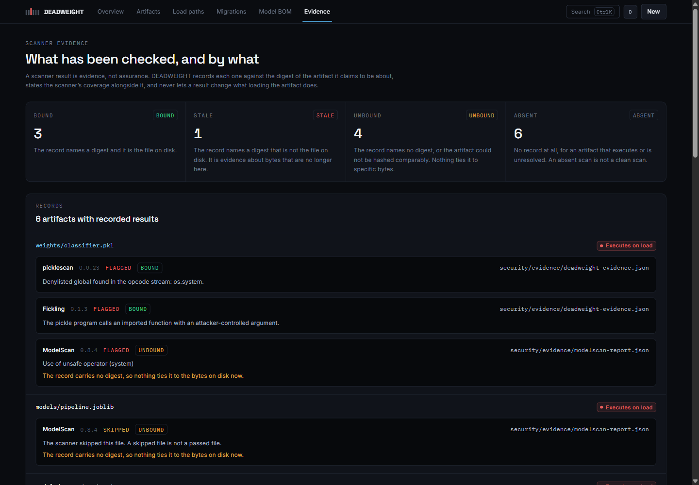 |
| **Model BOM** — the inventory, with native, CycloneDX 1.6 and CSV exports, and the unresolved reason carried into the document rather than omitted. | **Evidence** — what each scanner said, whether it still binds to the bytes on disk, and what that scanner cannot see. |
| 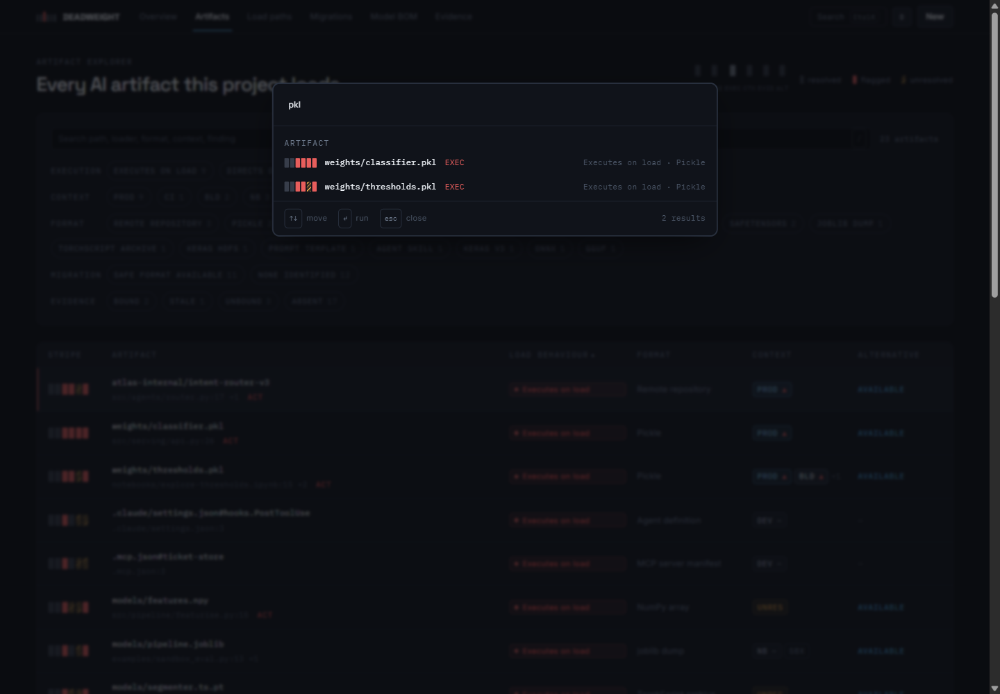 | 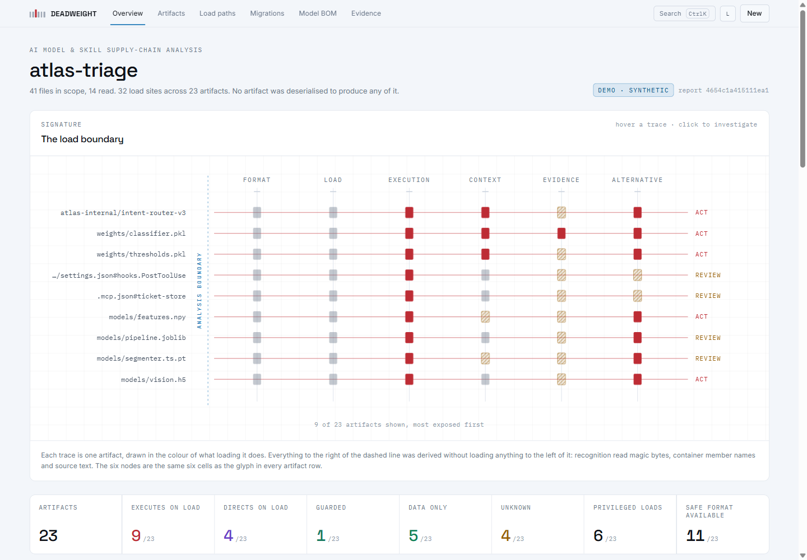 |
| **⌘K** — navigation, the filters you actually reach for, the exports, and every artifact by path. | **Light theme** — specified independently rather than inverted: the accents are darkened for paper and the surface stack runs the other way. |
| 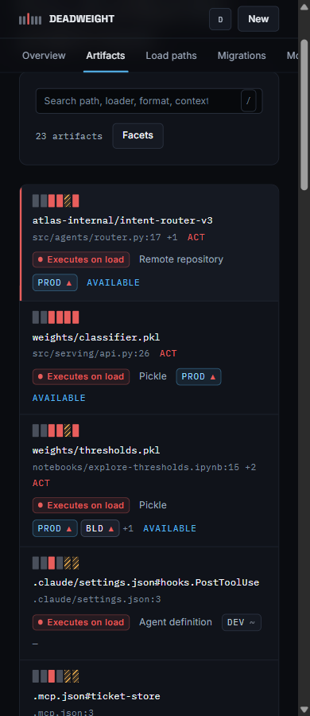 | 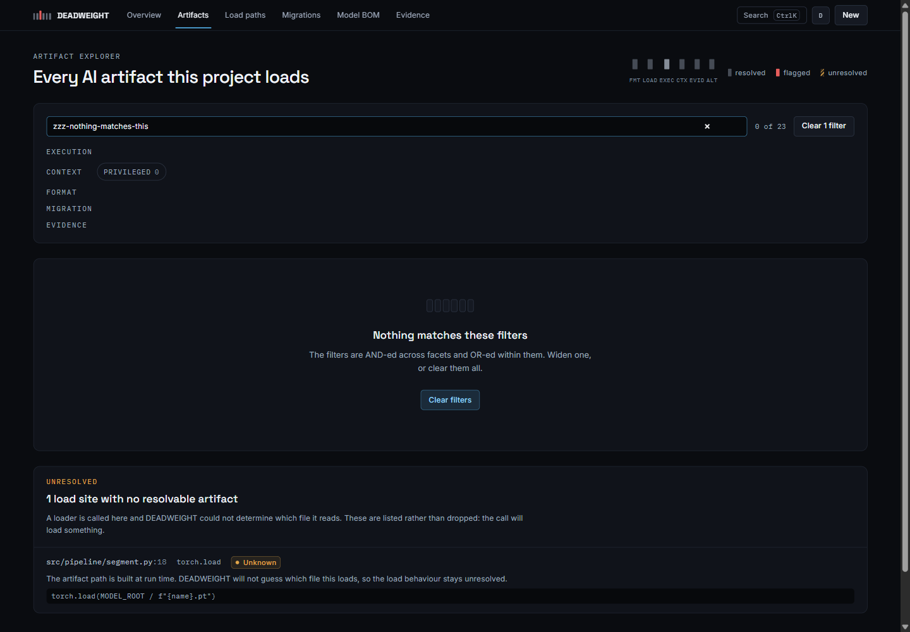 |
| **Mobile** — rows become cards and the facets fold behind a toggle. Nothing is dropped; the stripe, the behaviour, the context and the migration state are all still there. | **Empty states** — a filter that matches nothing says which filter, and offers to clear it. "No results" is the least useful thing a filtered table can say. |
| 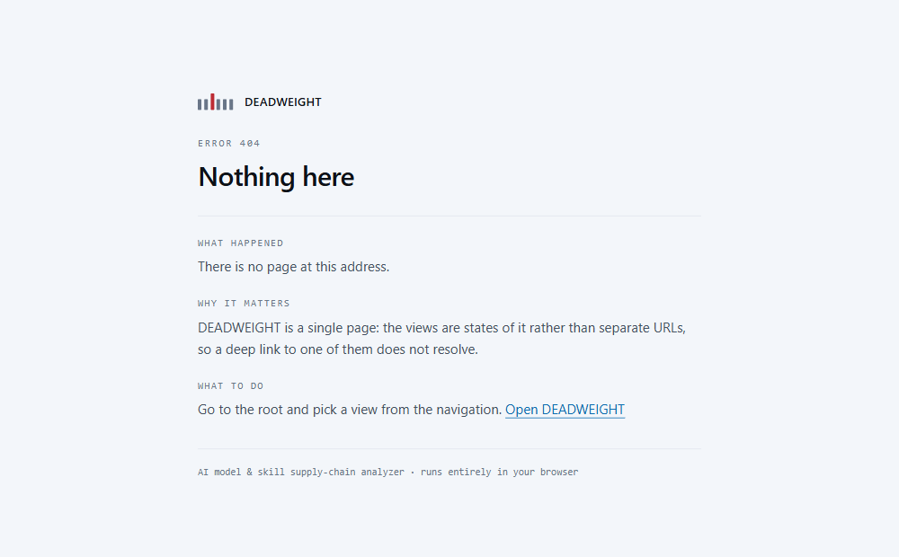 | 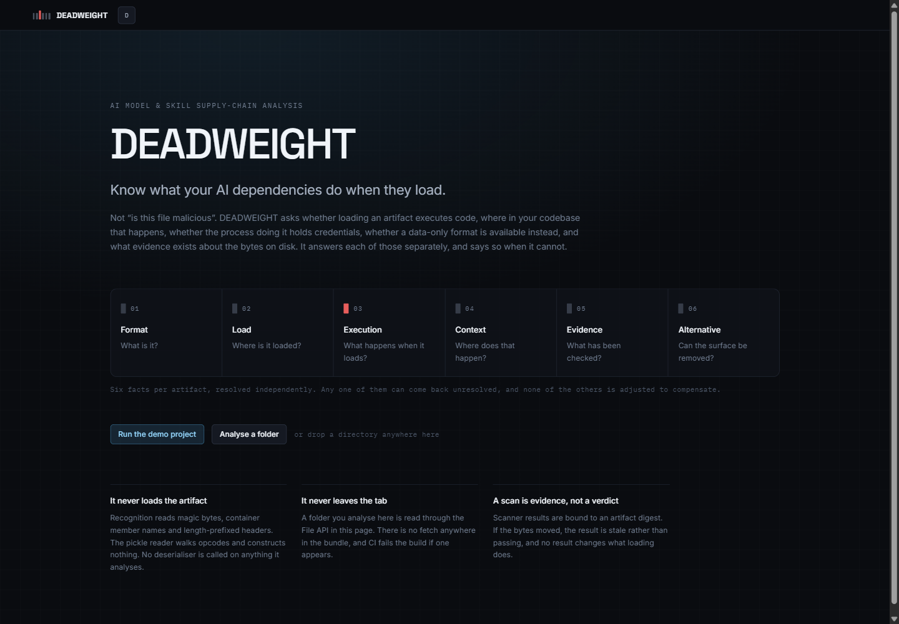 |
| **Error pages** — generated from one template, self-contained, and saying what happened, why it matters and what to do. A page that reports a network failure should not need the network. | **First run** — the question, the six stages that answer it, and the two ways in. No marketing copy above the fold. |

Every image is captured from the built app by `scripts/screenshots.ts`, so a
screenshot cannot show a product that does not exist.

## Capabilities

- **Discovers artifacts** from Python, JavaScript, TypeScript and Jupyter
  notebooks: pickles, PyTorch and TorchScript archives, joblib dumps, NumPy
  arrays, safetensors, ONNX, GGUF, TFLite, Keras HDF5 and v3, SavedModel,
  Flax msgpack — plus agent skills, agent definitions, MCP server manifests,
  hook commands and prompt templates.
  <!-- dw:formatcount -->21<!-- /dw --> formats,
  <!-- dw:loaders -->24<!-- /dw --> loader rules.
- **Classifies format from bytes**, not extensions: magic numbers,
  zip central-directory member names, length-prefixed headers, and a pickle
  opcode reader written from scratch that never unpickles.
- **Resolves load behaviour per call site** against the versions the project
  declares, and takes the most exposed of an artifact's sites as its verdict.
- **Separates executability from context.** Declared, inferred or unresolved —
  and it says which.
- **Reads privilege signals** in the loading file: cloud clients, named
  secrets, orchestration APIs, datastore writes, subprocess execution,
  outbound HTTP, filesystem writes.
- **Binds scanner evidence to digests**, so a result about bytes that have
  moved is stale rather than passing.
- **Finds the safe alternative** three ways: a data-only sibling already in
  the repository, a guard available at the call site, or a conversion — with
  the security difference and the caveat stated for each.
- **Generates a Model BOM** with no timestamp, so a diff between two of them
  is a diff of the project.
- **Diffs two BOMs** field by field, and says whether each change opened or
  closed an execution surface.
- **Exits usefully in a pipeline:** 0 clean, 2 findings at or above the
  threshold, 1 could not analyse.

## Limitations

Read these before trusting the output.

- **It does not know whether an artifact is malicious.** It reports surface,
  not intent. An artifact that executes on load is not compromised; it is
  loaded in a way that would execute whatever it contains.
- **It reads what the repository declares, not what is installed.** A lockfile
  is a claim. If the environment resolves differently, the behaviour resolution
  is wrong in the direction the lockfile pointed.
- **It makes no network requests.** A model referenced by repository name is
  reported as unresolvable, not fetched. Which weight formats that repository
  serves is outside the analysis.
- **Static analysis has a horizon.** A load target built at run time is
  reported as unresolved. A loader reached through a variable, a factory, or
  `getattr` is not found at all. Absence of a load site is not absence of a
  load.
- **A declared environment is a claim about deployment** that the tool cannot
  check.
- **Privilege signals are file-scoped.** "This file constructs a boto3 client"
  is not "this artifact exfiltrates to S3". It is "the process doing the load
  has that reach".
- **The pickle opcode reader is a static reader**, and static readers and
  CPython's unpickler have disagreed about the same bytes before. A stream
  written so the two read it differently is a known bypass class for any
  scanner of this design, including this one.
- **Skill and agent coverage follows current conventions** (`SKILL.md`
  frontmatter, `agents/*`, `.mcp.json`, `.claude/settings.json`). Other
  runtimes use other layouts and will not be found.

## Quick start

Node 24 or newer. The CLI needs nothing installed.

```bash
git clone https://github.com/het-P301204/deadweight.git
cd deadweight

# The CLI, against the bundled synthetic project
node bin/deadweight.ts scan fixtures/demo-project

# Against your own
node bin/deadweight.ts scan ../my-ml-project
node bin/deadweight.ts explain ../my-ml-project weights/model.pt
node bin/deadweight.ts migrations ../my-ml-project
node bin/deadweight.ts bom ../my-ml-project --format cyclonedx --out bom.json
```

| Command | Does |
| --- | --- |
| `scan <dir>` | Full analysis, written for a terminal |
| `artifacts <dir>` | One line per artifact |
| `loadpaths <dir>` | Every load site, grouped by file |
| `migrations <dir>` | Artifacts whose execution surface can be removed |
| `evidence <dir>` | Scanner records, and what each scanner can see |
| `bom <dir>` | Model BOM — `canonical`, `cyclonedx`, `csv` or `text` |
| `explain <dir> <id>` | Everything resolved about one artifact |
| `diff <a.json> <b.json>` | Compare two BOMs field by field |

The web interface:

```bash
npm install
npm run dev     # then open the URL it prints
npm run build   # static output in dist/, no server needed
```

It opens on the six stages and two buttons. **Run the demo project** analyses
a bundled synthetic repository through the real engine — not a fixture of
results — and **Analyse a folder** points it at your own, read through the
File API in the page. Nothing is uploaded, because there is nowhere to upload
it to.

In CI:

```yaml
- run: node bin/deadweight.ts scan . --quiet --fail-on execution
```

| `--fail-on` | Exit 2 when |
| --- | --- |
| `execution` (default) | any model artifact executes on load |
| `privileged` | an executing artifact is loaded where credentials are present |
| `unknown` | anything executes on load or could not be resolved |
| `any` | there is any finding at all |
| `none` | never |

Declare your environments once, in `deadweight.yaml`, and the context column
stops saying `unresolved`. See
[docs/schema-format.md](docs/schema-format.md#project-configuration).

## Security model

The tool is pointed at code it did not write. Both directions matter.

**It never loads an artifact to inspect one.** Recognition reads a bounded
head and tail slice and matches signatures; the pickle reader walks opcodes
and constructs nothing; a compressed joblib dump is recognised by its wrapper
and explicitly not decompressed. No deserialiser is called on anything under
analysis. CI greps the sources to keep it that way.

**Every read is bounded before it happens.** Path length, walk depth, entry
count, source size, notebook size, pickle opcodes and bytes, safetensors
header size, zip entries, line length. They are named in one file,
`src/engine/limits.ts`, so the threat model can point at it.

**The analysed tree cannot make the analyser hang.** Bounds alone are not
enough: a 2 MB line is *within* the source limit, and the expression that
once found calls backtracked quadratically over it — forty minutes of work
from one committed file. Call finding is linear now, reference resolution and
sibling lookup are indexed rather than rescanned, and both the suite and CI
time a deliberately hostile tree against a budget so a return of superlinear
behaviour fails the build.

**Untrusted input is treated as input.** Paths are refused rather than
repaired — no traversal, no absolute forms, no NUL. Symbolic links are listed
and never followed. Control characters that could rewrite a terminal line are
stripped from anything that came out of a scanned file. Parsed JSON has
prototype-polluting keys dropped at every level. Globs from the analysed
repository compile to regular expressions with no backtracking constructs.
CSV cells beginning with a formula character are neutralised. A malformed BOM
handed to `diff` is refused with guidance rather than a stack trace.

**Nothing leaves the page.** The browser build has no `fetch`, no
`XMLHttpRequest`, no beacon and no WebSocket; every font is bundled; the page
ships `connect-src 'none'`. CI fails the build if a network API appears in the
bundle. `frame-ancestors` belongs in a response header rather than the meta
policy, where a browser ignores it — set it at the host if you deploy this.

Full detail, including what is explicitly out of scope, in
[SECURITY.md](SECURITY.md).

## Development

```bash
npm install
npm test          # <!-- dw:tests -->308<!-- /dw --> cases over the engine and the design tokens
npm run lint
npm run typecheck
npm run build
npm run verify        # everything above, plus all four generator checks

npm run fixtures      # regenerate the binary demo fixtures
npm run demo-tree     # regenerate the browser-bundled demo project
npm run error-pages   # regenerate 403/404/500 from their template
npm run docs-numbers  # refresh the figures in this README
```

Four generated artifacts are checked in and verified by CI rather than
trusted: the binary fixtures, the bundled demo tree, the error pages, and
every figure in the documentation. Each has a `--check` mode that fails if the
committed output no longer matches its generator, which is how the demo
project the browser analyses cannot drift from the one the CLI is tested
against.

**<!-- dw:ciasserts -->14<!-- /dw --> of CI's
<!-- dw:cisteps -->21<!-- /dw --> steps assert a claim this README makes**,
rather than that the code compiles: that the engine reads no clock and no
random source, that two runs produce an identical digest, that no network API
appears in the bundle, that the engine references no browser global, that no
deserialising call reaches the analysis path, that every malformed fixture is
refused, that a hostile tree analyses inside a time budget, that a malformed
BOM gets guidance, that every loader rule points at a documented section, and
that the exit codes behave as documented. A claim nothing checks is a claim
nobody should believe, including you about this paragraph — the workflow is
[one file](.github/workflows/ci.yml).

Layout:

```
src/engine/     the analysis. No filesystem, no DOM, no network.
src/adapters/   node:fs, the browser File API, the bundled demo
src/ui/         primitives, the stripe, the diagrams
src/views/      the six views and the drawer
bin/            the CLI
fixtures/       the synthetic demo project and the malformed corpus
docs/           load semantics, methodology, schemas
```

## Documentation

- [Load semantics](docs/load-semantics.md) — every loader rule, and the
  release each version-dependent one turns on.
- [Methodology](docs/methodology.md) — how the analysis works, and where it
  stops.
- [Schemas](docs/schema-format.md) — the report, the BOM, the CycloneDX
  subset, the configuration and the evidence format.
- [Security model](SECURITY.md) — threat model, bounds, and what is out of
  scope.
- [Contributing](CONTRIBUTING.md) — how to add a loader rule, a format or an
  alternative.

## Demo project

`fixtures/demo-project` is a fabricated service. No real weights, no real
credentials, no real endpoints, no real customer. The binary artifacts are
generated by `scripts/make-fixtures.ts` and are the smallest byte sequences
genuinely recognisable as each format.

It exists so that the product can be seen working on a project containing one
of every situation the analyser has an answer for — including the ones where
the answer is "unresolved". It produces
<!-- dw:artifacts -->23<!-- /dw --> artifacts across
<!-- dw:loadsites -->32<!-- /dw --> load sites and
<!-- dw:environments -->7<!-- /dw --> environments:
<!-- dw:code -->9<!-- /dw --> execute on load,
<!-- dw:directive -->4<!-- /dw --> direct on load,
<!-- dw:guarded -->1<!-- /dw --> is guarded,
<!-- dw:data -->5<!-- /dw --> are data only and
<!-- dw:unknown -->4<!-- /dw --> could not be resolved.
<!-- dw:privileged -->6<!-- /dw --> are loaded where credentials are present,
<!-- dw:migrations -->11<!-- /dw --> have a safe format available, and
<!-- dw:stale -->1<!-- /dw --> scanner record has gone stale.
That is <!-- dw:findings -->42<!-- /dw --> findings:
<!-- dw:act -->12<!-- /dw --> to act on and
<!-- dw:review -->21<!-- /dw --> to review.

Every figure in that paragraph is written by `npm run docs-numbers` from an
actual analysis, and CI fails if the prose drifts from it.

## Licence

Apache-2.0. See [LICENSE](LICENSE).
